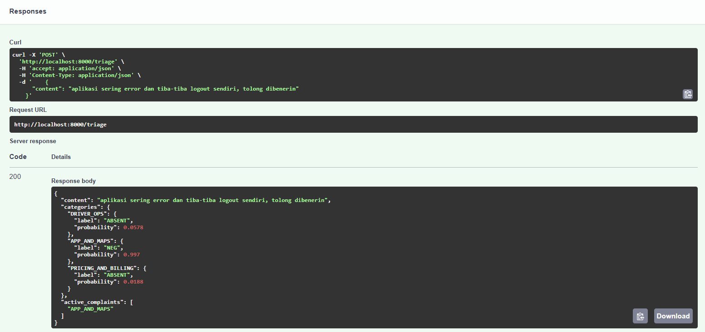
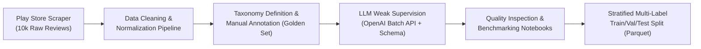
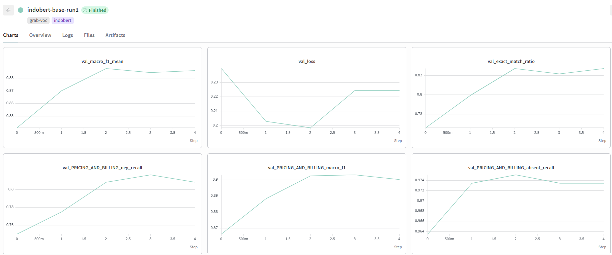

# Grab Voice-of-Customer (VOC) Review Triage Pipeline

An end-to-end Machine Learning and MLOps system to automatically categorize and triage customer feedback for Grab Superapp into actionable operational domains using fine-tuned **IndoBERT**.

---

## 🎯 Problem Statement & Taxonomy

Customer reviews on app stores contain high-volume, multi-topic feedback. Manual triage is slow and costly. This project classifies incoming customer reviews in Indonesian into three primary operational categories:

| Category | Description | Examples |
|---|---|---|
| **`DRIVER_OPS`** | Driver behavior, cancellations, safety, communication, pickup issues | *"Driver minta cancel sembarangan dan marah-marah"* |
| **`APP_AND_MAPS`** | Technical glitches, crashes, GPS inaccuracy, OTP, payment failures | *"Aplikasi sering force close dan titik jemput meleset jauh"* |
| **`PRICING_AND_BILLING`** | High fares, unexpected surge, voucher bugs, top-up/wallet deductions | *"Ongkir mahal banget gila dan diskon tidak terpasang"* |

Each category is treated as an independent binary classification task (`NEG` = complaint requiring triage, `ABSENT` = no negative issue detected), supporting **multi-label complaints** in a single review.

---

## 🛠️ Data Engineering & Curation Pipeline

To build a high-quality dataset from scratch without expensive manual labeling across the entire corpus, this project implemented a **Data-Centric AI** workflow combining real-world scraping, human ground-truth validation, and LLM-assisted weak supervision:



1. **Real-World VOC Collection (`data_scripts/01_scraper.py`)**:
   - Automated ingestion of **10,000 raw customer reviews** directly from the Google Play Store for Grab Indonesia (`lang='id', country='id'`).
   - Captured review content, star ratings, timestamps, and user interaction metadata.

2. **Cleaning & Text Normalization Pipeline (`data_scripts/02_cleaning.py`)**:
   - Implemented an extensible Pandas pipeline (`.pipe()`) chaining character normalization, whitespace cleaning, length filtering, and duplicate removal.
   - Handled noisy colloquial Indonesian (*Bahasa Gaul*), abbreviations, and emojis typical in mobile user feedback.

3. **Human Ground-Truth & Taxonomy Validation (`data_scripts/03_manual_annotation.py`)**:
   - Manually annotated a seed sample across all three operational categories to establish an authoritative "golden test set".
   - Refined and validated the 3-domain taxonomy against real-world ambiguous edge cases (e.g., driver asking customer to cancel due to payment method disputes).

4. **LLM-Assisted Weak Supervision (`data_scripts/05_batch_classify_api_openai.py`)**:
   - Scaled annotation across the corpus cost-effectively using the **OpenAI Batch API** (`gpt-4o-mini`) with strict JSON schema enforcement (`Pydantic / Structured Outputs`).
   - Built chunking (500 reviews/chunk), automated status polling, and resume-on-failure mechanisms.
   - Audited the LLM-generated pseudo-labels against human ground truth in evaluation notebooks (`notebooks/03_...`, `notebooks/04_...`) to guarantee label quality and alignment before training.

5. **Stratified Multi-Label Split (`data_scripts/06_train_val_test_split.py`)**:
   - Executed stratified multi-label sampling to prevent label leakage and preserve the class distribution across train, validation, and test sets stored in columnar Parquet format.

---

## 📊 Benchmark Results

Evaluated on the held-out test dataset using the best fine-tuned checkpoint:

| Metric | Score |
|---|---|
| **Mean Macro F1** | **88.91%** |
| **Exact Match Ratio (All 3 labels)** | **84.00%** |
| `DRIVER_OPS` Macro F1 | **89.37%** |
| `APP_AND_MAPS` Macro F1 | **89.01%** |
| `PRICING_AND_BILLING` Macro F1 | **88.34%** |

### Training Progression & Experiment Tracking (Weights & Biases)


---

## 🏗️ System Architecture

```
grab-voc-triage/
├── app.py                      # FastAPI microservice application
├── Dockerfile                  # GPU training container image for Vertex AI
├── Dockerfile.serve            # Lightweight CPU/GPU serving container image
├── evaluate.py                 # Offline evaluation & metric benchmarking script
├── train.py                    # Hydra-based PyTorch training loop
├── requirements.txt            # Project dependencies
├── configs/                    # Hydra configuration files
│   ├── train.yaml              # Main training configuration
│   ├── model/                  # Model architectures (IndoBERT, etc.)
│   ├── dataset/                # Dataset & batch size settings
│   └── tracker/                # W&B / experiment tracking settings
├── data_scripts/               # Crawling, cleaning, and annotation split pipeline
└── src/
    ├── data/dataset.py         # PyTorch Dataset and Tokenizer wrapper
    ├── models/hf_pretrained.py  # IndoBERT Multi-label Classifier
    ├── schemas/prediction.py   # Pydantic schemas for API & inference
    ├── inference/pipeline.py   # High-performance batch inference engine
    └── utils/                  # Metrics and GCS synchronization utilities
```

---

## 🚀 Quickstart: FastAPI Microservice

### 1. Installation
```bash
conda activate grab-voc-triage
pip install -r requirements.txt
```

### 2. Run Locally
```bash
python app.py
# Or with uvicorn:
uvicorn app:app --host 0.0.0.0 --port 8000 --reload
```

### 3. Interactive Documentation
Once started, visit:
- **Swagger UI**: [http://localhost:8000/docs](http://localhost:8000/docs)
- **ReDoc**: [http://localhost:8000/redoc](http://localhost:8000/redoc)

---

## 📡 API Endpoints & Usage

### 1. Health Probe (`GET /health`)
```bash
curl -X GET http://localhost:8000/health
```
```json
{
  "status": "healthy",
  "model_name": "indobert-base-p1-grab-triage",
  "device": "cuda",
  "categories": ["DRIVER_OPS", "APP_AND_MAPS", "PRICING_AND_BILLING"]
}
```

### 2. Single Review Triage (`POST /triage`)
```bash
curl -X POST http://localhost:8000/triage \
  -H "Content-Type: application/json" \
  -d '{"content": "aplikasinya sering error dan tiba-tiba logout sendiri, tolong dibenerin"}'
```
```json
{
  "content": "aplikasinya sering error dan tiba-tiba logout sendiri, tolong dibenerin",
  "categories": {
    "DRIVER_OPS": { "label": "ABSENT", "probability": 0.0458 },
    "APP_AND_MAPS": { "label": "NEG", "probability": 0.9973 },
    "PRICING_AND_BILLING": { "label": "ABSENT", "probability": 0.0239 }
  },
  "active_complaints": ["APP_AND_MAPS"]
}
```

### 3. Batched Triage (`POST /triage/batch`)
```bash
curl -X POST http://localhost:8000/triage/batch \
  -H "Content-Type: application/json" \
  -d '{
    "contents": [
      "drivernya ramah sekali",
      "ongkir mahal banget gak masuk akal",
      "gps nya ngaco dan maps muter-muter"
    ]
  }'
```

---

## 🐳 Containerization & Deployment

### Local Docker
```bash
# Build serving image
docker build -f Dockerfile.serve -t grab-voc-triage:latest .

# Run container
docker run -p 8000:8000 --rm grab-voc-triage:latest
```

### Serverless Cloud Run Deployment
Deploy serverless auto-scaling microservice to Google Cloud Run:
```bash
gcloud run deploy grab-voc-triage-api \
  --source . \
  --dockerfile Dockerfile.serve \
  --region asia-southeast1 \
  --platform managed \
  --memory 2Gi \
  --cpu 2 \
  --allow-unauthenticated
```

---

## 🏋️ Training & Evaluation

### Train Locally / Cloud
```bash
python train.py tracker=wandb
```

### Run Offline Benchmark
```bash
python evaluate.py
```
Outputs full classification metrics and saves predictions to `data/preds/indobert_test_preds.csv`.